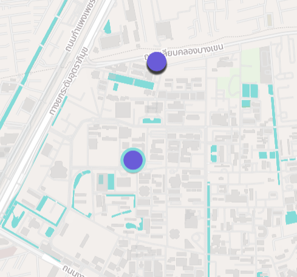
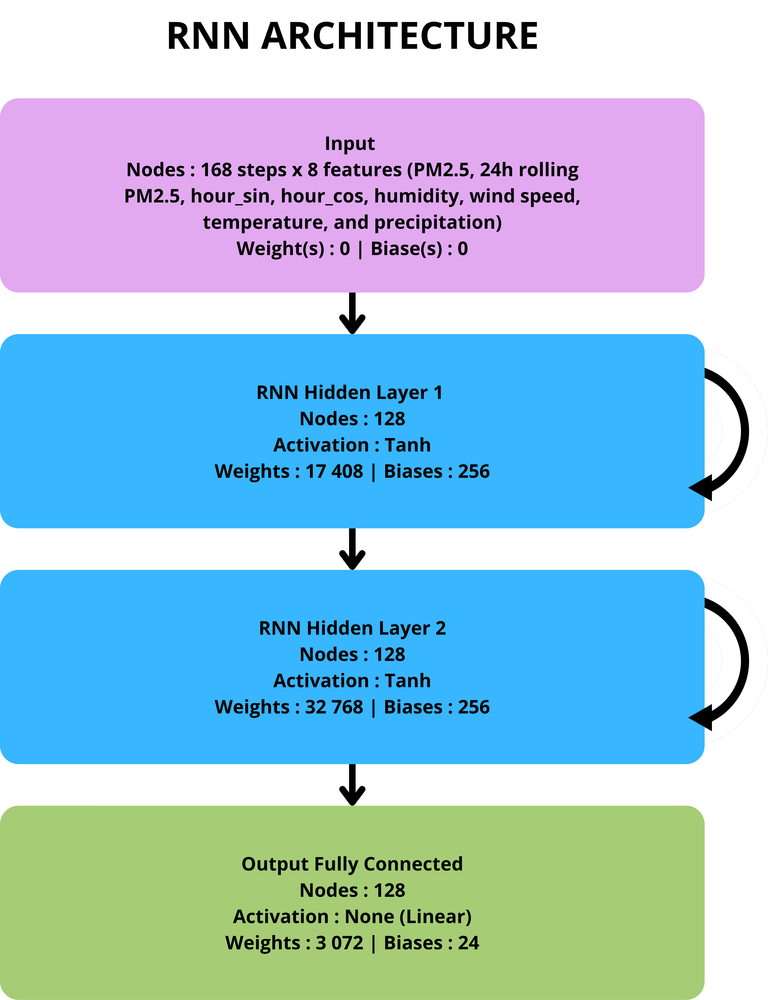
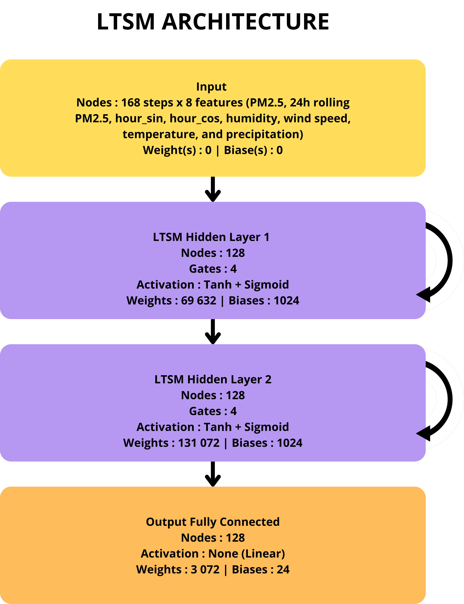
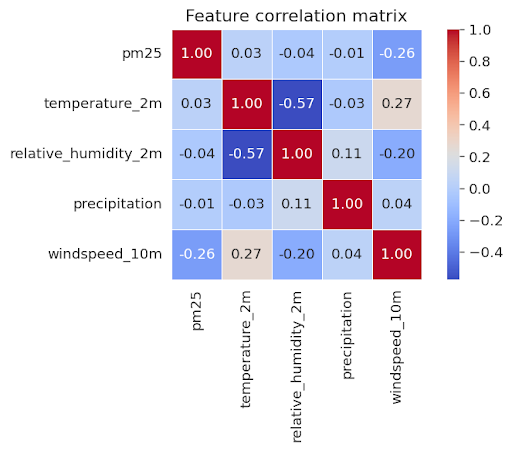
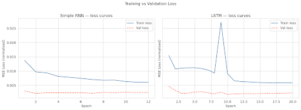
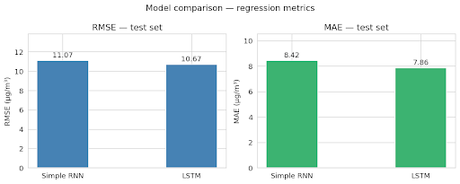
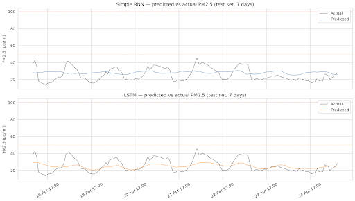
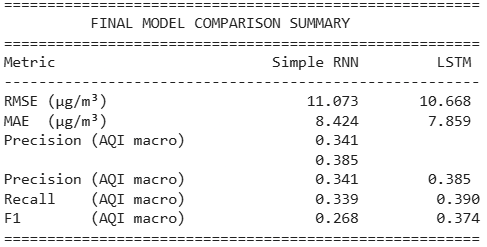

# final_project_Deep_Learning
Repository for Deep Learning course's final project
[final_project_DL_LeaROTA_QuentinHOUBART.md](https://github.com/user-attachments/files/27489944/final_project_DL_LeaROTA_QuentinHOUBART.md)
**Final Project 204466 Deep learning**

Quentin HOUBART \- Student ID : 6810045546  
Léa ROTA \- Student ID : 6810045112

Our final project topic is about predicting the PM2.5 concentration in µg/m³ in Bangkok.

**Why this topic ?**  
This topic is interesting because pollution is a significant problem around the world and especially in Bangkok, a city known for its congested roads (that we’ve experienced firsthand\!) and air pollution (it is ranked 37th in the world for the most pollution according to IQAir \- a swiss based air quality technology company keeping track of pollution around the world).   
Coming from small cities in France, PM2.5 pollution is not really a concern of ours, so experiencing a PM2.5 spike with Thai government warnings during our exchange semester brought this topic to our attention and that is why we chose it for our project.

**Why does this topic require Deep Learning**  
This topic requires Deep Learning to solve the problem because air quality is dependent on a lot of factors (mainly meteorological : other pollutants’ concentration, wind speed, rain, location in the city, etc…) and manually finding a correlation between them and the PM2.5 level would be hard to do.  
Other approaches to this problem include : 

* a feed forward neural network used in this project [https://github.com/krittintrs/DL-for-PM2.5-Prediction](https://github.com/krittintrs/DL-for-PM2.5-Prediction) (also for Bangkok),   
* a regression model in this project [https://github.com/prince381/air-pollution/](https://github.com/prince381/air-pollution/) (for the city of Beijing, China),   
* or a Light Gradient Boosting Machine (LGBM), Gradient Boosting Regressor (GBR), Extreme Gradient Boosting Regressor (XGBR) and Random Forest (RF) to predict PM2.5 pollution in the city of Mashhad, Iran ([https://www.nature.com/articles/s41598-025-92019-3](https://www.nature.com/articles/s41598-025-92019-3))

**Strengths and weaknesses :**  
The main strength of the Deep Learning approach is its capacity to detect the correlations between the different factors and their influence on the PM2.5 level, something impossible to do at a human level.  
The main weakness of our approach is mostly about the data. Depending on your sources, the data can be spotty (missing hourly data) and thus lead to inconclusive results. We solved this problem by using 2 different sensors on the KU campus and overlapping their data to fill the potential gaps.

Position of the 2 sensors on the KU Campus

**Why our Deep Learning architecture(s) :**   
Our problem is sequential, the PM2.5 concentration in the air at hour \[t\] is directly linked to the PM2.5 concentration at hour \[t-1\], so the obvious choice for us was to implement a RNN (Recurrent Neural Network) and an LSTM (Long Short Term Memory) because they are the 2 architectures we studied in class for solving sequential problems like music generation.

We used the same architecture in both types of network, namely : 

**Code explanation :**   
The code goes these different steps in order : 

1. Collect the last 6 months PM2.5 concentration data from 2 sensors located on the KU Campus from the platform OpenAQ. We learned through experience that we should collect this data in small batches of 1 month so as to not overload the API.  
2. Collect the last 6 months of weather data (temperature, relative humidity, precipitation and windspeed) from the OpenMeteo platform.  
3. Merge both datasets collected into one single dataset, aligning it according to the day and hour at which the measurements were made.  
4. Filling the gaps, sometimes the sensors (especially the ones from the OpenAQ platform) are missing several hours.   
   When more than 3 hours are missing at a time, we choose to interpolate them. This produces artificial data but in our opinion, artificial and complete data is better than incomplete data, especially because we are trying to get our model to learn a sequential pattern.  
5. Plot some of the data (PM2.5, temperature and wind speed). This part does not really serve any purpose in advancing the models but is rather a check. We can quickly see where data was missing and how the gaps were subsequently filled in all metrics.  
6. Plot a feature correlation matrix, to see which feature influences which other the most. We notice here that the strongest correlated feature to PM2.5 is windspeed, when the wind is strong, the PM2.5 is low. This is something we will come back to later.

7. Engineer the features we will use later on in the training :   
   Compute a 24-hour rolling average of the PM2.5   
   Transform the hour of the day into a sine/cosine ratio instead of a simple integer, because for a computer 23h and 00h are not next to each other but they are in reality (11pm and midnight).  
   Leave the others as is, because the model will use them this way.  
8. Split the data into train/val/set and scale it so the minimum value of each feature becomes 0 and the maximum value becomes 1\.   
   For this split it is paramount that we do not shuffle the data. Because the data is a time series, each time step is dependent on the previous one and this order must be kept.  
   This means that on 6 months of data and for a 70/15/15 split, the training data will encompass the first 4,2 months of data, the validation data the next 0,9 months and the test data the remaining 0,9 months.  
   We are aware that this split causes a problem (especially because 6 months is short, this problem would have been mitigated with 3 years or more of data fx) because, to put it simply, the model trains on December weather to predict May weather. But in our case, preventing data leakage and protecting the time dependence of the data is more important.  
9. Create the samples in each category, with the sequence we give to the model and the sequence we want the model to predict, just like we did in the character-level text generation labs.  
   In our case, we give the models the 7 days of data prior (168 hours) and ask them to predict the next day (the next 24 hours).  
10. Define our models. We define one RNN and one LSTM model, each with the same architecture and the same hyperparameters to be able to compare them afterwards. Both use 8 inputs, have 2 hidden layers containing 128 nodes, output 24 values (at once), have a learning rate of 1e-3 and train for 50 epochs (unless they dropout before).  
    Both the RNN and the LSTM use tanh as an activation function and the LSTM uses sigmoid internally for its gate mechanism that lets it “keep memory”.  
11. Trains the models using Mean Square Error as a loss and Adam as an optimizer.  
12. Evaluates the models by first collecting/computing the different metrics (MSE/MAE), then by classifying the predictions based on the Air Quality Index (AQI) as either true or false to compute precision, recall and the F1 score.  
13. Uses the models for what it was made for by predicting the next day of PM2.5 measurements according to the last week.  
14. Finally, the code visualizes the training/validation loss curves, the predictions compared to the reality and the MAE/MSE metrics.

**Github repo of the project :**   
The GitHub repo of our project can be found at this link :   
[GitHub repo](https://github.com/quentin1houbart-afk/final_project_Deep_Learning.git) 

**Google collab link :**   
[Google colab for the final project](https://colab.research.google.com/drive/1yrfhPSz_h8icyikIRo6lbpqj5jWd4dz3?usp=sharing) 

**Training method, dataset and resources :**  
As mentioned before, we gathered the dataset ourselves, using information available freely online. We used the ‘OpenAQ’ platform to get the PM2.5 concentration data from 2 different sensors placed on the Kasetsart University campus, and the ‘OpenMeteo’ platform to get the remaining relevant meteorological data.

With this dataset created we engineered the features useful to us as mentioned in the code explication before splitting the data.

The actual training procedure is standard in recurrent deep learning applications, we use a sliding window to give the model the past context (roughly up to what can influence the day’s predictions) and ask it to predict the next day’s PM2.5 concentration in the air.   
The models make a forward pass, then gradients are calculated and backpropagated through time to update them.

We kept the same architecture for both models, to be able to compare them in the future : 8 inputs then 2 layers of 128 nodes each and 24 outputs.  
The hyperparameters used are the same as mentioned in the code explanation, we also set the same for both models : a learning rate of 1e-3, batch size of 64 and 50 epochs.

We chose to use MSE as a loss because this is a regression task and it penalises large prediction errors quadratically, and encourages the model to stay close to the actual PM2.5 values, along with the Adam optimizer which we read online is robust against varying gradient magnitudes often encountered in recurrent deep learning tasks.

The training also uses early stopping to keep the model from overfitting and learning the data.  
Finally, we implemented gradient clipping to prevent the exploding gradient problem that is also encountered often in recurrent deep learning tasks.

**Evaluation of the models**  
To evaluate the models, we will show different curves and comment on them.  

Starting with the training and validation loss curves for both models shown side by side. The LSTM loss curve spikes at epoch 9 during the training, most likely because of an exploding/vanishing gradient problem, but we see the model recovers and the loss then continues to go down.  
We do not get much from these graphs, apart from the fact that the training goes normally and the models do not overfit.

Then on these graphs you can see the computed MSE and MAE for the 2 different models. We see that the LSTM outperforms the RNN but only by a slight margin. The RMSE is bigger than the MAE because there were some outliers in the dataset (during the pollution peaks earlier this year that we encountered during February/March) which may have influenced it.  

Then, these graphs are the predictions of the 2 models on the test set, shown for 7 days.   
On these 2 graphs we can clearly see that the LSTM captures the highs and lows (corresponding to day and night) better than the RNN because where the RNN stays almost flat, the LSTM really captures the daily down trend (not that much the daily up).   
This improvement proves that the LSTM model is better at capturing the latent correlations in sequential data.  
The models also consistently underestimate the spikes actual values because there are few outliers and the dataset is clearly unbalanced so the models predict more averages values, but this is in line with the fact that the month of April is much more windy than months prior to is, and as we hinted at earlier, wind strongly correlates with low PM2.5.

Finally, the precision, recall and F1 scores for both models are given on the image above.  
We must specify that the metrics are bad because of the dataset given to the model. The pollution spikes in the dataset are rare (thankfully \!) which makes the dataset heavily imbalanced in favor of average PM 2.5 values (good and moderate in the AQI classification scale) and tanks the precision and recall.  
But debiasing the dataset in our case does not have a sense because this imbalance represents a reality of the Bangkok weather and does not discriminate against anyone.  
**Work partitioning**  
We both contributed equally to this project, although Léa Rota contributed more to the code and Quentin Houbart more to the report.

|  | Léa Rota | Quentin Houbart |
| :---- | :---- | :---- |
| Code | 60% | 40% |
| Report | 40% | 60% |
| Overall participation | 50% | 50% |

